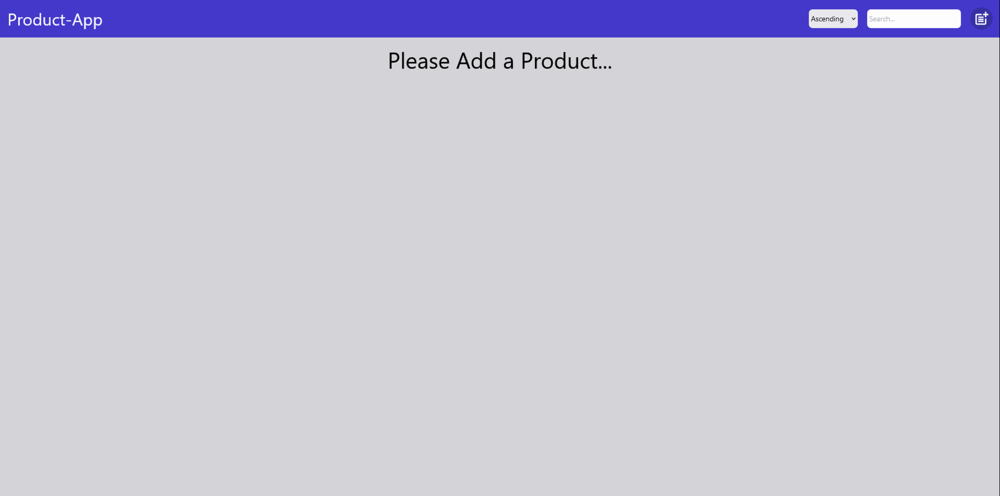

# Product-App in React Vİte

## Description

This project is a Product Management application built using React with Vite as the bundler. It allows users to add, update, remove, and search products. It also features sorting functionality and uses Redux Toolkit for state management.

## Features

- Add new products
- Update existing products
- Remove products
- Search products by name
- Sort products by price in ascending or descending order
- Responsive design using Tailwind CSS

## Libraries

- **@reduxjs/toolkit**:Redux Toolkit for efficient Redux state management.
- **react-redux**:Official React bindings for Redux, to connect React components with Redux store.
- **react-icons**:Library for popular icons as React components.
- **react-router-dom**:Declarative routing for React applications
- **tailwind**:Utility-first CSS framework for styling.
- **react-notifications-component**:Library for displaying notifications in React applications.

## Usage

- Add new products by filling out the form and clicking "Add".
- Update existing products by clicking the "Update" button on the product card.
- Remove products by clicking the "Delete" button on the product card.
- Search for products by typing in the search input.
- Sort products using the dropdown menu to select ascending or descending order.

## Preview



## Deployment

The project is deployed and can be accessed [here](). For the project to run smoothly, please follow the installation steps below to set it up locally.The project may behave differently across different browsers.

## Installation

To run the project locally, follow these steps:

1. Clone the repository:

```bash
git clone https://github.com/KamilErdogmus/Product-App.git
```

2. Navigate to the project directory:

```bash
cd your-repository
```

3. Install dependencies:

```bash
npm install
```

4. Start the development server:

```bash
npm start / npm run dev
```

5. Open your web browser and visit http://localhost:3000 to view the application.
